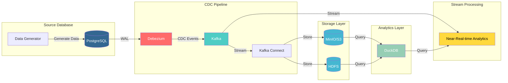

# Change Data Capture (CDC) with Debezium, Kafka, and PostgreSQL

This repository demonstrates a Change Data Capture (CDC) implementation using Debezium, Kafka, and PostgreSQL. It's based on the [Change Data Capture with Debezium](https://www.startdataengineering.com/post/change-data-capture-using-debezium-kafka-and-pg/) blog post at startdataengineering.com.

## Overview

This project implements a CDC pipeline that:
- Captures changes from PostgreSQL using Debezium
- Streams changes through Kafka
- Stores the change data in MinIO (S3-compatible storage)
- Provides analysis capabilities using DuckDB

## Architecture
### LAMBDA Architecture



### Source Layer
- **PostgreSQL**: Source database with WAL (Write-Ahead Logging) enabled
- **Data Generator**: Creates test data for demonstration

### CDC Pipeline
- **Debezium**: CDC connector that captures database changes
- **Kafka**: Message broker for streaming changes
- **Kafka Connect**: Manages connectors and data flow

### Storage Layer
- **MinIO**: S3-compatible object storage
- **HDFS**: Distributed file system for large-scale storage

### Analytics Layer
- **DuckDB**: SQL analytics engine for querying the change data

### Stream Processing Components
- **Stream Consumer**: Python application that:
  - Consumes CDC events from Kafka
  - Processes near-real-time data changes
  - Maintains consumer group offset

## Prerequisites

Before you begin, ensure you have the following installed:

1. **Git** (version >= 2.37.1)
   - [Installation Guide](https://github.com/git-guides/install-git)

2. **Docker** (version >= 20.10.17) and **Docker Compose** (v2 >= v2.10.2)
   - [Docker Installation Guide](https://docs.docker.com/engine/install/)
   - [Docker Compose Installation Guide](https://docs.docker.com/compose/#compose-v2-and-the-new-docker-compose-command)

3. **pgcli**
   - [Installation Guide](https://www.pgcli.com/install)

### Windows Users

If you're using Windows, please:
1. Set up WSL and install Ubuntu following [these instructions](https://ubuntu.com/tutorials/install-ubuntu-on-wsl2-on-windows-10#1-overview)
2. Install the prerequisites in your Ubuntu terminal
3. For Docker installation issues, follow [these steps](https://www.digitalocean.com/community/tutorials/how-to-install-and-use-docker-on-ubuntu-22-04#step-1-installing-docker)
4. Install make command: `sudo apt install make -y`

## Getting Started

1. Clone the repository:
```bash
git@github.com:vengleab/near-realt-ime-anaytics.git
cd near-realtime-anaytics
```

2. Start the environment:
```bash
# Ensure Docker is running
docker ps

# Start all containers
make start

# Wait for containers to initialize
sleep 60

# Set up connectors
make connectors

# Wait for data to be pushed to MinIO
sleep 60

# Open MinIO UI
make minio-ui
```

3. Access MinIO UI:
   - URL: http://localhost:9001
   - Username: `minio`
   - Password: `minio123`

You should see the following paths in MinIO:
- `commerce/debezium.commerce.products`
- `commerce/debezium.commerce.users`

These contain JSON files with create, update, and delete operations from the respective tables.

## Analyzing Data with DuckDB

The project mounts a local folder to the MinIO container, allowing direct access to the data. To analyze the data:

1. Start DuckDB:
```bash
./duckdb
```

2. Configure DuckDB for S3 access:
```sql
INSTALL httpfs;
LOAD httpfs;
SET s3_region='us-east-1';
SET s3_endpoint='localhost:9000';
SET s3_access_key_id='minio';
SET s3_secret_access_key='minio123';
SET s3_use_ssl=false;
SET s3_url_style='path';
```

3. Create a view for the CDC data:
```sql
CREATE OR REPLACE VIEW S3_DATA AS 
SELECT
    COALESCE(CAST(json->'value'->'after'->'id' AS INT), 
             CAST(json->'value'->'before'->'id' AS INT)) AS id,
    json->'value'->'before' AS before_row_value,
    json->'value'->'after' AS after_row_value,
    CASE
        WHEN CAST(json->'value'->'$.op' AS CHAR(1)) = '"c"' THEN 'CREATE'
        WHEN CAST(json->'value'->'$.op' AS CHAR(1)) = '"d"' THEN 'DELETE'
        WHEN CAST(json->'value'->'$.op' AS CHAR(1)) = '"u"' THEN 'UPDATE'
        WHEN CAST(json->'value'->'$.op' AS CHAR(1)) = '"r"' THEN 'SNAPSHOT'
        ELSE 'INVALID'
    END AS operation_type,
    CAST(json->'value'->'source'->'lsn' AS BIGINT) AS log_seq_num,
    epoch_ms(CAST(json->'value'->'source'->'ts_ms' AS BIGINT)) AS source_timestamp
FROM read_ndjson_objects('s3://commerce/debezium.commerce.products/*/*/*.json');
```

4. Create a Type 2 SCD view:
```sql
CREATE OR REPLACE VIEW vw_products_cdc_type_2 AS
WITH products_create_update_delete AS (
    SELECT
        COALESCE(CAST(json->'value'->'after'->'id' AS INT), 
                 CAST(json->'value'->'before'->'id' AS INT)) AS id,
        json->'value'->'before' AS before_row_value,
        json->'value'->'after' AS after_row_value,
        CASE
            WHEN CAST(json->'value'->'$.op' AS CHAR(1)) = '"c"' THEN 'CREATE'
            WHEN CAST(json->'value'->'$.op' AS CHAR(1)) = '"d"' THEN 'DELETE'
            WHEN CAST(json->'value'->'$.op' AS CHAR(1)) = '"u"' THEN 'UPDATE'
            WHEN CAST(json->'value'->'$.op' AS CHAR(1)) = '"r"' THEN 'SNAPSHOT'
            ELSE 'INVALID'
        END AS operation_type,
        CAST(json->'value'->'source'->'lsn' AS BIGINT) AS log_seq_num,
        epoch_ms(CAST(json->'value'->'source'->'ts_ms' AS BIGINT)) AS source_timestamp
    FROM read_ndjson_objects('s3://commerce/debezium.commerce.products/*/*/*.json')
    WHERE log_seq_num IS NOT NULL
)
SELECT
    id,
    CAST(after_row_value->'name' AS VARCHAR(255)) AS name,
    CAST(after_row_value->'description' AS TEXT) AS description,
    CAST(after_row_value->'price' AS NUMERIC(10, 2)) AS price,
    source_timestamp AS row_valid_start_timestamp,
    CASE 
        WHEN LEAD(source_timestamp, 1) OVER lead_txn_timestamp IS NULL 
        THEN CAST('9999-01-01' AS TIMESTAMP) 
        ELSE LEAD(source_timestamp, 1) OVER lead_txn_timestamp 
    END AS row_valid_expiration_timestamp
FROM products_create_update_delete
WHERE id in (SELECT id FROM products_create_update_delete GROUP BY id HAVING COUNT(*) > 0)
WINDOW lead_txn_timestamp AS (PARTITION BY id ORDER BY log_seq_num)
ORDER BY id, row_valid_start_timestamp;
```

## Available Make Commands

The project includes several make commands for easier management:

- `make start`: Start all containers (PostgreSQL, data generator, Kafka Connect, Kafka, MinIO)
- `make connectors`: Set up Debezium and S3 sink connectors
- `make down`: Stop all containers
- `make minio-ui`: Open MinIO UI in your browser


## Stream Consumer

The project includes a Python-based stream consumer that processes CDC events in real-time. This component:

1. **Consumes Kafka Messages**:
   - Listens to the `debezium.commerce.products` topic
   - Processes CDC events as they occur
   - Maintains consumer group offset for reliable processing

2. **Real-time Analytics**:
   - Tracks price changes for products
   - Maintains a Type 2 Slowly Changing Dimension (SCD) view
   - Provides real-time price change history
   - Calculates current total product value

### Setup and Usage

1. **Install Dependencies**:
```bash
cd stream_consumer
pipenv install
```

2. **Run the Consumer**:
```bash
pipenv run consumer
```

### Features

- **Real-time Price Tracking**: Monitors and displays price changes as they occur
- **Historical Analysis**: Maintains a complete history of product changes
- **Current Value Calculation**: Provides real-time sum of current product prices
- **Error Handling**: Robust error handling and graceful shutdown
- **Configurable**: Easy to modify for different topics or analysis requirements
